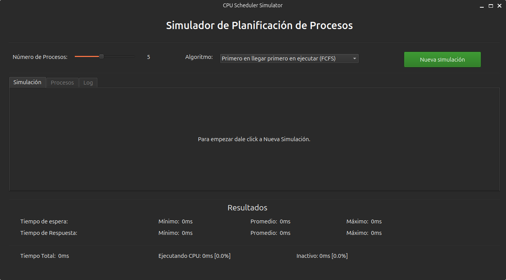
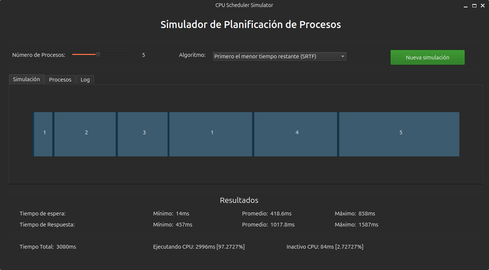

# Simulador de Planificación de Procesos del CPU

Esta es una herramienta de software que simula varios algoritmos de planificación de procesos comúnmente utilizados en sistemas operativos. El objetivo del proyecto es obtener experiencia práctica en entender, implementar y analizar el comportamiento de diferentes algoritmos de planificación de procesos.

La app está escrita en C++ y utiliza Qt para la interfaz gráfica

 ### Algoritmos Implementados
- No Expulsivos
    - Primero en llegar primero en ejecutar (FCFS)
    - Primero el trabajo más corto (SJF)
    - Selección aleatoria
    - Planificación basada en prioridades
- Expulsivos
    - Turno rotativo (round robin)
    - Primero el menor tiempo restante (SRTF)
    - Planificación basada en prioridades

El simulador cuenta con una interfaz que permite a los usuarios:

- Generar de manera aleatoria detalles de procesos como tiempo de llegada (arrival time), tiempo de procesamiento (burst time) y prioridad.
- Seleccionar diferentes algoritmos de planificación para observar su comportamiento.

## Instalar y Ejecutar

Para abrir la aplicación basta con abrir el proyecto en [Qt Creator](https://www.qt.io/download-open-source) y ejecutar desde su IDE.

## Créditos

- Johan Manuel Paredes Pino V27507388